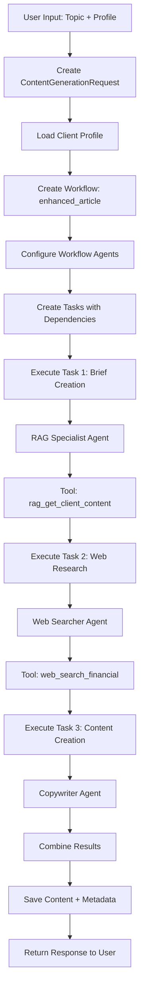

# 🤖 CGSRef: Context for Agent - Piano Dettagliato dell'Applicazione

## 📋 Indice
1. [Overview Architetturale](#overview-architetturale)
2. [Core Domain](#core-domain)
3. [Application Layer](#application-layer)
4. [Infrastructure Layer](#infrastructure-layer)
5. [API Layer](#api-layer)
6. [Web Interface](#web-interface)
7. [Flussi di Esecuzione](#flussi-di-esecuzione)
8. [Sistema di Logging](#sistema-di-logging)
9. [Configurazione e Deploy](#configurazione-e-deploy)
10. [Esempi Pratici](#esempi-pratici)

---

## 🏗️ Overview Architetturale

### **Architettura Clean Architecture + DDD**
```
┌─────────────────────────────────────────────────────────────┐
│                    🌐 WEB INTERFACE                         │
│  React App + Material-UI + TypeScript + Vite               │
└─────────────────────────────────────────────────────────────┘
                              │
┌─────────────────────────────────────────────────────────────┐
│                      🔌 API LAYER                          │
│  FastAPI + REST Endpoints + CLI Commands                   │
└─────────────────────────────────────────────────────────────┘
                              │
┌─────────────────────────────────────────────────────────────┐
│                   📋 APPLICATION LAYER                     │
│  Use Cases + DTOs + Service Orchestration                  │
└─────────────────────────────────────────────────────────────┘
                              │
┌─────────────────────────────────────────────────────────────┐
│                    🏛️ CORE DOMAIN                          │
│  Entities + Value Objects + Domain Services                │
└─────────────────────────────────────────────────────────────┘
                              │
┌─────────────────────────────────────────────────────────────┐
│                  🔧 INFRASTRUCTURE LAYER                   │
│  LLM Providers + Repositories + Orchestration + Logging    │
└─────────────────────────────────────────────────────────────┘
```

### **Principi Architetturali**
- **🎯 Domain-Driven Design**: Logica business nel core domain
- **🔄 Dependency Inversion**: Infrastructure dipende da Domain
- **📦 Modularità**: Componenti indipendenti e testabili
- **🔌 Plugin Architecture**: Provider LLM intercambiabili
- **📊 Observability**: Logging completo e metriche

---

## 🏛️ Core Domain

### **1. Entities Principali**

#### **🤖 Agent Entity**
```python
# File: core/domain/entities/agent.py
class Agent:
    id: UUID
    name: str                    # "rag_specialist", "copywriter"
    role: AgentRole             # RESEARCHER, WRITER, ANALYST
    goal: str                   # Obiettivo specifico agent
    backstory: str              # Background e personalità
    system_message: str         # Prompt di sistema
    provider_config: ProviderConfig  # Configurazione LLM
    tools: List[str]            # Tool disponibili
    created_at: datetime
    updated_at: datetime
```

#### **📋 Task Entity**
```python
# File: core/domain/entities/task.py
class Task:
    id: UUID
    name: str                   # "task1_brief", "task2_research"
    description: str            # Descrizione dettagliata
    agent_role: AgentRole       # Ruolo agent richiesto
    task_type: TaskType         # RESEARCH, WRITING, ANALYSIS
    tools: List[str]            # Tool necessari
    dependencies: List[UUID]    # Task prerequisiti
    status: TaskStatus          # PENDING, RUNNING, COMPLETED
    result: Optional[str]       # Output del task
    created_at: datetime
    execution_time: Optional[float]
```

#### **🔄 Workflow Entity**
```python
# File: core/domain/entities/workflow.py
class Workflow:
    id: UUID
    name: str                   # "enhanced_article_generation"
    workflow_type: WorkflowType # ENHANCED_ARTICLE, NEWSLETTER
    client_profile: str         # "siebert", "default"
    tasks: List[Task]           # Task del workflow
    status: WorkflowStatus      # CREATED, RUNNING, COMPLETED
    context: Dict[str, Any]     # Context condiviso
    created_at: datetime
    completed_at: Optional[datetime]
```

### **2. Value Objects**

#### **⚙️ Generation Parameters**
```python
# File: core/domain/value_objects/generation_params.py
@dataclass(frozen=True)
class GenerationParams:
    topic: str                  # "AI in Finance"
    content_type: ContentType   # ARTICLE, NEWSLETTER, BLOG_POST
    target_audience: str        # "Gen Z investors"
    tone: str                   # "Professional yet accessible"
    style: str                  # "Educational, engaging"
    generation_mode: GenerationMode  # ENHANCED, STANDARD, QUICK
    target_word_count: Optional[int]
    seo_keywords: List[str]
    custom_instructions: Optional[str]
```

#### **🏢 Client Profile**
```python
# File: core/domain/value_objects/client_profile.py
@dataclass(frozen=True)
class ClientProfile:
    name: str                   # "siebert"
    brand_voice: str            # "Professional yet accessible"
    target_audience: str        # "Gen Z and young professionals"
    key_messages: List[str]     # Brand messaging
    terminology: Dict[str, str] # Terminologia specifica
    content_guidelines: str     # Linee guida contenuto
    rag_enabled: bool          # RAG disponibile
```

### **3. Domain Services**

#### **🎭 Agent Selection Service**
```python
# File: core/domain/services/agent_selection_service.py
class AgentSelectionService:
    def select_agent_for_task(self, task: Task, available_agents: List[Agent]) -> Optional[Agent]
    def create_workflow_agents(self, workflow_type: WorkflowType, client_profile: str) -> List[Agent]
    def get_agent_capabilities(self, agent: Agent) -> AgentCapabilities
```

#### **🔄 Workflow Orchestration Service**
```python
# File: core/domain/services/workflow_orchestration_service.py
class WorkflowOrchestrationService:
    def create_workflow(self, request: ContentGenerationRequest) -> Workflow
    def get_executable_tasks(self, workflow: Workflow) -> List[Task]
    def update_task_dependencies(self, workflow: Workflow, completed_task: Task)
```

---

## 📋 Application Layer

### **1. Use Cases Principali**

#### **🎯 Generate Content Use Case**
```python
# File: core/application/use_cases/generate_content.py
class GenerateContentUseCase:
    def __init__(self, 
                 workflow_repository: WorkflowRepository,
                 agent_repository: AgentRepository,
                 task_orchestrator: TaskOrchestrator,
                 rag_service: Optional[RAGService] = None):
        
    async def execute(self, request: ContentGenerationRequest) -> ContentGenerationResponse:
        # 1. Load client profile
        client_profile = await self._load_client_profile(request.client_profile)
        
        # 2. Create workflow
        workflow = await self._create_workflow(request)
        
        # 3. Configure agents for workflow
        await self._configure_workflow_agents(workflow, request)
        
        # 4. Execute workflow
        result = await self._execute_workflow(workflow, request, client_profile)
        
        # 5. Save results
        await self._save_results(workflow, result)
        
        return ContentGenerationResponse(
            content=result.content,
            workflow_id=workflow.id,
            execution_summary=result.summary
        )
```

#### **📊 Get Workflow Status Use Case**
```python
# File: core/application/use_cases/get_workflow_status.py
class GetWorkflowStatusUseCase:
    async def execute(self, workflow_id: UUID) -> WorkflowStatusResponse:
        workflow = await self.workflow_repository.get_by_id(workflow_id)
        
        return WorkflowStatusResponse(
            workflow_id=workflow.id,
            status=workflow.status,
            progress=self._calculate_progress(workflow),
            current_task=self._get_current_task(workflow),
            estimated_completion=self._estimate_completion(workflow)
        )
```

### **2. DTOs (Data Transfer Objects)**

#### **📥 Content Generation Request**
```python
# File: core/application/dto/content_request.py
@dataclass
class ContentGenerationRequest:
    topic: str
    client_profile: str
    workflow_type: str
    generation_params: Optional[GenerationParams] = None
    target_audience: Optional[str] = None
    custom_context: Optional[Dict[str, Any]] = None
```

#### **📤 Content Generation Response**
```python
# File: core/application/dto/content_response.py
@dataclass
class ContentGenerationResponse:
    content: str
    workflow_id: UUID
    execution_summary: ExecutionSummary
    metadata: ContentMetadata
    created_at: datetime
```

---

## 🔧 Infrastructure Layer

### **1. LLM Providers**

#### **🧠 LLM Provider Interface**
```python
# File: core/infrastructure/llm/base_provider.py
class BaseLLMProvider(ABC):
    @abstractmethod
    async def generate(self, messages: List[Dict], config: LLMConfig) -> LLMResponse
    
    @abstractmethod
    def get_provider_name(self) -> str
    
    @abstractmethod
    def calculate_cost(self, tokens: int, model: str) -> float
```

#### **🤖 OpenAI Provider**
```python
# File: core/infrastructure/llm/openai_provider.py
class OpenAIProvider(BaseLLMProvider):
    def __init__(self, api_key: str, default_model: str = "gpt-4"):
        self.client = AsyncOpenAI(api_key=api_key)
        self.default_model = default_model
        
    async def generate(self, messages: List[Dict], config: LLMConfig) -> LLMResponse:
        response = await self.client.chat.completions.create(
            model=config.model or self.default_model,
            messages=messages,
            temperature=config.temperature,
            max_tokens=config.max_tokens
        )
        
        return LLMResponse(
            content=response.choices[0].message.content,
            usage=response.usage,
            cost_usd=self.calculate_cost(response.usage.total_tokens, config.model)
        )
```

### **2. Repositories**

#### **📁 YAML Agent Repository**
```python
# File: core/infrastructure/repositories/yaml_agent_repository.py
class YamlAgentRepository(AgentRepository):
    def __init__(self, base_path: str = "data/profiles"):
        self.base_path = Path(base_path)
        
    async def get_by_client_profile(self, client_profile: str) -> List[Agent]:
        profile_path = self.base_path / client_profile / "agents"
        agents = []
        
        for yaml_file in profile_path.glob("*.yaml"):
            agent_data = self._load_yaml(yaml_file)
            agent = self._create_agent_from_yaml(agent_data)
            agents.append(agent)
            
        return agents
```

#### **💾 In-Memory Workflow Repository**
```python
# File: core/infrastructure/repositories/memory_workflow_repository.py
class InMemoryWorkflowRepository(WorkflowRepository):
    def __init__(self):
        self._workflows: Dict[UUID, Workflow] = {}
        
    async def save(self, workflow: Workflow) -> None:
        self._workflows[workflow.id] = workflow
        
    async def get_by_id(self, workflow_id: UUID) -> Optional[Workflow]:
        return self._workflows.get(workflow_id)
```

### **3. Orchestration**

#### **🎭 Agent Executor**
```python
# File: core/infrastructure/orchestration/agent_executor.py
class AgentExecutor:
    def __init__(self, llm_provider: BaseLLMProvider, tool_registry: ToolRegistry):
        self.llm_provider = llm_provider
        self.tool_registry = tool_registry
        
    async def execute_agent(self, agent: Agent, task_description: str, context: Dict[str, Any]) -> str:
        # 🚀 Start logging session
        session_id = agent_logger.start_agent_session(
            agent_id=str(agent.id),
            agent_name=agent.name,
            task_description=task_description
        )
        
        try:
            # 🧠 Build system message with context
            system_message = self._build_system_message(agent, context)
            
            # 🔧 Configure LLM
            llm_config = self._get_llm_config(agent, context)
            
            # 🚀 Execute LLM
            response = await self.llm_provider.generate(
                messages=[
                    {"role": "system", "content": system_message},
                    {"role": "user", "content": task_description}
                ],
                config=llm_config
            )
            
            # 🏁 End session
            agent_logger.end_agent_session(session_id, success=True, final_output=response.content)
            
            return response.content
            
        except Exception as e:
            agent_logger.end_agent_session(session_id, success=False, error_message=str(e))
            raise
```

#### **📋 Task Orchestrator**
```python
# File: core/infrastructure/orchestration/task_orchestrator.py
class TaskOrchestrator:
    def __init__(self, agent_executor: AgentExecutor, agent_repository: AgentRepository):
        self.agent_executor = agent_executor
        self.agent_repository = agent_repository
        
    async def execute_workflow(self, workflow: Workflow, context: Dict[str, Any]) -> WorkflowResult:
        results = {}
        
        while workflow.has_executable_tasks():
            executable_tasks = workflow.get_executable_tasks()
            
            for task in executable_tasks:
                # 🎯 Get agent for task
                agent = await self._get_agent_for_task(task, context)
                
                if agent:
                    # 🚀 Execute task with agent
                    result = await self.agent_executor.execute_agent(
                        agent=agent,
                        task_description=task.description,
                        context={**context, **results}
                    )
                    
                    # ✅ Update task and workflow
                    task.complete(result)
                    results[task.name] = result
                    workflow.update_task_status(task.id, TaskStatus.COMPLETED)
                else:
                    # 🔄 Mock execution for missing agents
                    result = await self._mock_execute_task(task, context)
                    task.complete(result)
                    results[task.name] = result
                    workflow.update_task_status(task.id, TaskStatus.COMPLETED)
        
        return WorkflowResult(
            content=self._combine_results(results),
            summary=self._create_execution_summary(workflow, results)
        )
```

---

## 🔌 API Layer

### **1. REST API (FastAPI)**

#### **🌐 Content Generation Endpoint**
```python
# File: api/rest/endpoints/content.py
@router.post("/generate", response_model=ContentGenerationResponse)
async def generate_content(
    request: ContentGenerationRequest,
    use_case: GenerateContentUseCase = Depends(get_content_use_case)
) -> ContentGenerationResponse:
    """Generate content using AI agents workflow."""
    
    try:
        response = await use_case.execute(request)
        return response
    except Exception as e:
        logger.error(f"Content generation failed: {e}")
        raise HTTPException(status_code=500, detail=str(e))

@router.get("/workflow/{workflow_id}/status", response_model=WorkflowStatusResponse)
async def get_workflow_status(
    workflow_id: UUID,
    use_case: GetWorkflowStatusUseCase = Depends(get_workflow_status_use_case)
) -> WorkflowStatusResponse:
    """Get workflow execution status."""
    
    try:
        response = await use_case.execute(workflow_id)
        return response
    except Exception as e:
        logger.error(f"Failed to get workflow status: {e}")
        raise HTTPException(status_code=404, detail="Workflow not found")
```

#### **📊 Health Check & Metrics**
```python
# File: api/rest/endpoints/health.py
@router.get("/health")
async def health_check():
    """System health check."""
    return {
        "status": "healthy",
        "timestamp": datetime.utcnow(),
        "version": "1.0.0"
    }

@router.get("/metrics")
async def get_metrics():
    """System metrics and statistics."""
    return {
        "workflows_executed": workflow_counter.get(),
        "agents_active": agent_counter.get(),
        "average_execution_time": avg_execution_time.get()
    }
```

### **2. CLI Interface**

#### **🖥️ CLI Commands**
```python
# File: api/cli/main.py
@app.command()
def generate(
    topic: str,
    client_profile: str = "default",
    workflow_type: str = "enhanced_article",
    output_file: Optional[str] = None
):
    """Generate content via CLI."""
    
    request = ContentGenerationRequest(
        topic=topic,
        client_profile=client_profile,
        workflow_type=workflow_type
    )
    
    # Execute use case
    use_case = get_content_use_case()
    response = asyncio.run(use_case.execute(request))
    
    # Output results
    if output_file:
        with open(output_file, 'w') as f:
            f.write(response.content)
        console.print(f"✅ Content saved to {output_file}")
    else:
        console.print(response.content)

@app.command()
def list_profiles():
    """List available client profiles."""
    profiles = get_available_profiles()
    
    table = Table(title="Available Client Profiles")
    table.add_column("Profile", style="cyan")
    table.add_column("Description", style="green")
    
    for profile in profiles:
        table.add_row(profile.name, profile.description)
    
    console.print(table)
```

---

## 🌐 Web Interface

### **1. React Frontend Structure**

#### **📁 Struttura Componenti**
```
web/react-app/src/
├── components/
│   ├── ContentGeneration/
│   │   ├── ContentForm.tsx          # Form generazione contenuto
│   │   ├── WorkflowSelector.tsx     # Selezione workflow
│   │   └── ClientProfileSelector.tsx # Selezione profilo cliente
│   ├── WorkflowStatus/
│   │   ├── WorkflowProgress.tsx     # Progress bar workflow
│   │   ├── TaskList.tsx             # Lista task con status
│   │   └── AgentActivity.tsx        # Attività agent in tempo reale
│   └── Results/
│       ├── ContentDisplay.tsx       # Display contenuto generato
│       ├── ExecutionSummary.tsx     # Riassunto esecuzione
│       └── MetricsPanel.tsx         # Metriche e statistiche
├── services/
│   ├── apiService.ts                # Client API REST
│   ├── websocketService.ts          # WebSocket per real-time updates
│   └── storageService.ts            # Local storage management
├── hooks/
│   ├── useContentGeneration.ts      # Hook per generazione contenuto
│   ├── useWorkflowStatus.ts         # Hook per status workflow
│   └── useRealTimeUpdates.ts        # Hook per aggiornamenti real-time
└── types/
    ├── api.ts                       # Tipi API
    ├── workflow.ts                  # Tipi workflow
    └── content.ts                   # Tipi contenuto
```

#### **🎨 Content Generation Form**
```typescript
// File: web/react-app/src/components/ContentGeneration/ContentForm.tsx
interface ContentFormProps {
  onSubmit: (request: ContentGenerationRequest) => void;
  loading: boolean;
}

export const ContentForm: React.FC<ContentFormProps> = ({ onSubmit, loading }) => {
  const [formData, setFormData] = useState<ContentGenerationRequest>({
    topic: '',
    client_profile: 'default',
    workflow_type: 'enhanced_article',
    target_audience: ''
  });

  const handleSubmit = (e: React.FormEvent) => {
    e.preventDefault();
    onSubmit(formData);
  };

  return (
    <Paper sx={{ p: 3 }}>
      <Typography variant="h5" gutterBottom>
        🤖 Generate Content with AI Agents
      </Typography>
      
      <form onSubmit={handleSubmit}>
        <TextField
          fullWidth
          label="Topic"
          value={formData.topic}
          onChange={(e) => setFormData({...formData, topic: e.target.value})}
          margin="normal"
          required
        />
        
        <ClientProfileSelector
          value={formData.client_profile}
          onChange={(profile) => setFormData({...formData, client_profile: profile})}
        />
        
        <WorkflowSelector
          value={formData.workflow_type}
          onChange={(workflow) => setFormData({...formData, workflow_type: workflow})}
        />
        
        <Button
          type="submit"
          variant="contained"
          fullWidth
          disabled={loading}
          sx={{ mt: 2 }}
        >
          {loading ? <CircularProgress size={24} /> : 'Generate Content'}
        </Button>
      </form>
    </Paper>
  );
};
```

#### **📊 Workflow Progress Component**
```typescript
// File: web/react-app/src/components/WorkflowStatus/WorkflowProgress.tsx
interface WorkflowProgressProps {
  workflow: Workflow;
  realTimeUpdates: boolean;
}

export const WorkflowProgress: React.FC<WorkflowProgressProps> = ({ 
  workflow, 
  realTimeUpdates 
}) => {
  const { status, progress } = useWorkflowStatus(workflow.id, realTimeUpdates);

  return (
    <Card sx={{ mt: 2 }}>
      <CardContent>
        <Typography variant="h6" gutterBottom>
          🔄 Workflow Progress
        </Typography>
        
        <LinearProgress 
          variant="determinate" 
          value={progress} 
          sx={{ mb: 2 }}
        />
        
        <Typography variant="body2" color="text.secondary">
          {progress}% Complete - {status}
        </Typography>
        
        <TaskList tasks={workflow.tasks} />
        
        {realTimeUpdates && (
          <AgentActivity workflowId={workflow.id} />
        )}
      </CardContent>
    </Card>
  );
};
```

### **2. API Service Client**

#### **🔌 API Service**
```typescript
// File: web/react-app/src/services/apiService.ts
class ApiService {
  private baseUrl = '/api/v1';

  async generateContent(request: ContentGenerationRequest): Promise<ContentGenerationResponse> {
    const response = await fetch(`${this.baseUrl}/content/generate`, {
      method: 'POST',
      headers: { 'Content-Type': 'application/json' },
      body: JSON.stringify(request)
    });

    if (!response.ok) {
      throw new Error(`HTTP error! status: ${response.status}`);
    }

    return response.json();
  }

  async getWorkflowStatus(workflowId: string): Promise<WorkflowStatusResponse> {
    const response = await fetch(`${this.baseUrl}/content/workflow/${workflowId}/status`);
    
    if (!response.ok) {
      throw new Error(`HTTP error! status: ${response.status}`);
    }

    return response.json();
  }

  async getAvailableProfiles(): Promise<ClientProfile[]> {
    const response = await fetch(`${this.baseUrl}/profiles`);
    return response.json();
  }
}

export const apiService = new ApiService();
```

---

## 🔄 Flussi di Esecuzione

### **1. Flusso Completo: Enhanced Article Generation**

#### **📋 Step-by-Step Flow**


#### **🎯 Detailed Execution Flow**
```python
# 1. USER INPUT
request = ContentGenerationRequest(
    topic="AI in Finance",
    client_profile="siebert",
    workflow_type="enhanced_article",
    target_audience="Gen Z investors"
)

# 2. LOAD CLIENT PROFILE
client_profile = ClientProfile.create_siebert_profile()
# → brand_voice: "Professional yet accessible"
# → target_audience: "Gen Z and young professionals"
# → key_messages: ["Financial empowerment", "Breaking barriers"]

# 3. CREATE WORKFLOW
workflow = Workflow(
    name="enhanced_article_ai_finance",
    workflow_type=WorkflowType.ENHANCED_ARTICLE,
    client_profile="siebert"
)

# 4. CONFIGURE AGENTS
agents = [
    Agent(name="rag_specialist", role=RESEARCHER, tools=["rag_get_client_content"]),
    Agent(name="web_searcher", role=RESEARCHER, tools=["web_search_financial"]),
    Agent(name="copywriter", role=WRITER, tools=[])
]

# 5. CREATE TASKS
tasks = [
    Task(name="task1_brief", agent_role=RESEARCHER, dependencies=[]),
    Task(name="task2_research", agent_role=RESEARCHER, dependencies=["task1_brief"]),
    Task(name="task3_content", agent_role=WRITER, dependencies=["task1_brief", "task2_research"])
]

# 6. EXECUTE WORKFLOW
for task in workflow.get_executable_tasks():
    agent = get_agent_for_task(task)
    result = await agent_executor.execute_agent(agent, task.description, context)
    task.complete(result)
    workflow.update_task_status(task.id, COMPLETED)

# 7. COMBINE RESULTS
final_content = combine_task_results([
    task1_result,  # Brief from RAG
    task2_result,  # Research from Web
    task3_result   # Final article from Copywriter
])

# 8. RETURN RESPONSE
return ContentGenerationResponse(
    content=final_content,
    workflow_id=workflow.id,
    execution_summary=create_summary(workflow)
)
```

### **2. Agent Selection Strategy**

#### **🎯 Multi-Level Agent Selection**
```python
async def _get_agent_for_task(self, task: Task, context: Dict[str, Any]) -> Optional[Agent]:
    # PRIORITY 1: Workflow-specific agents
    if task.name == "task1_brief":
        return self._create_rag_specialist_agent()
    elif task.name == "task2_research":
        return self._create_web_searcher_agent()
    elif task.name == "task3_content":
        return self._create_copywriter_agent()
    
    # PRIORITY 2: Role-based selection
    elif task.agent_role == AgentRole.RESEARCHER:
        return self._create_researcher_agent()
    elif task.agent_role == AgentRole.WRITER:
        return self._create_writer_agent()
    
    # PRIORITY 3: Client profile repository
    client_profile = context.get('client_profile', 'default')
    agents = await self.agent_repository.get_by_client_profile(client_profile)
    matching_agents = [a for a in agents if a.role == task.agent_role]
    
    return matching_agents[0] if matching_agents else None
```

### **3. Context Propagation**

#### **📝 Context Building and Propagation**
```python
def _build_execution_context(self, request: ContentGenerationRequest, client_profile: ClientProfile) -> Dict[str, Any]:
    """Build comprehensive context for agent execution."""
    
    base_context = {
        # Request context
        'topic': request.topic,
        'target_audience': request.target_audience,
        'workflow_type': request.workflow_type,
        
        # Client context
        'client_profile': client_profile.name,
        'brand_voice': client_profile.brand_voice,
        'key_messages': client_profile.key_messages,
        'terminology': client_profile.terminology,
        
        # Generation context
        'generation_params': request.generation_params,
        'custom_context': request.custom_context or {}
    }
    
    return base_context

def _enrich_context_with_results(self, context: Dict[str, Any], task_results: Dict[str, str]) -> Dict[str, Any]:
    """Enrich context with previous task results."""
    
    enriched_context = context.copy()
    
    # Add task results
    enriched_context.update(task_results)
    
    # Add derived context
    if 'task1_brief' in task_results:
        enriched_context['brief_summary'] = self._extract_brief_summary(task_results['task1_brief'])
    
    if 'task2_research' in task_results:
        enriched_context['research_insights'] = self._extract_research_insights(task_results['task2_research'])
    
    return enriched_context
```

---

## 📊 Sistema di Logging

### **1. AgentLogger: Logging Specializzato**

#### **🔍 Tipi di Interazioni Tracciate**
```python
class InteractionType(Enum):
    # Agent lifecycle
    AGENT_START = "agent_start"           # 🚀 Inizio agent
    AGENT_END = "agent_end"               # 🏁 Fine agent
    AGENT_THINKING = "agent_thinking"     # 💭 Processo ragionamento
    
    # Tool interactions
    TOOL_CALL = "tool_call"               # 🛠️ Chiamata tool
    TOOL_RESPONSE = "tool_response"       # ✅ Risposta tool
    TOOL_ERROR = "tool_error"             # ❌ Errore tool
    
    # LLM interactions
    LLM_REQUEST = "llm_request"           # 🧠 Richiesta LLM
    LLM_RESPONSE = "llm_response"         # 💬 Risposta LLM
    LLM_ERROR = "llm_error"               # 🚨 Errore LLM
    
    # Context management
    CONTEXT_UPDATE = "context_update"     # 📝 Aggiornamento context
    DECISION_POINT = "decision_point"     # 🤔 Punto decisionale
```

#### **📋 LogEntry Structure**
```python
@dataclass
class LogEntry:
    id: UUID                              # ID unico entry
    timestamp: datetime                   # Timestamp UTC
    interaction_type: InteractionType     # Tipo interazione
    level: str                           # DEBUG, INFO, WARNING, ERROR
    
    # Agent/Task context
    agent_id: Optional[str]              # ID agent
    agent_name: Optional[str]            # Nome agent
    tool_name: Optional[str]             # Nome tool
    task_id: Optional[str]               # ID task
    workflow_id: Optional[str]           # ID workflow
    
    # Content
    message: str                         # Messaggio principale
    data: Dict[str, Any]                 # Dati strutturati
    
    # Metrics
    duration_ms: Optional[float]         # Durata operazione
    tokens_used: Optional[int]           # Token LLM utilizzati
    cost_usd: Optional[float]            # Costo USD
```

### **2. Session-Based Logging**

#### **🔄 Session Management**
```python
# Start agent session
session_id = agent_logger.start_agent_session(
    agent_id="agent_123",
    agent_name="rag_specialist",
    task_id="task_brief_001",
    workflow_id="workflow_article_456",
    task_description="Create comprehensive brief for AI in Finance"
)

# Track session metrics
session_data = {
    'agent_id': agent_id,
    'start_time': time.time(),
    'tool_calls': 0,
    'llm_calls': 0,
    'total_tokens': 0,
    'total_cost': 0.0
}

# End session with summary
agent_logger.end_agent_session(
    session_id=session_id,
    success=True,
    final_output="Generated comprehensive brief...",
    error_message=""
)
```

#### **📊 Logging Output Example**
```
2024-01-15 10:30:15 | 🚀 [rag_specialist] AGENT STARTED: rag_specialist
2024-01-15 10:30:16 | 🧠 [rag_specialist] LLM REQUEST: openai/gpt-4
2024-01-15 10:30:17 | 🛠️ [rag_specialist][rag_get_client_content] TOOL CALL: rag_get_client_content
2024-01-15 10:30:18 | ✅ [rag_specialist][rag_get_client_content] TOOL RESPONSE: rag_get_client_content (1.2s)
2024-01-15 10:30:19 | 💬 [rag_specialist] LLM RESPONSE: openai/gpt-4 (850 tokens, $0.0085, 2.3s)
2024-01-15 10:30:20 | 🏁 [rag_specialist] AGENT COMPLETED: rag_specialist (5.2s total)
```

### **3. Metrics e Analytics**

#### **📈 Execution Summary**
```python
@dataclass
class ExecutionSummary:
    workflow_id: UUID
    total_duration_seconds: float
    agents_used: int
    tasks_completed: int
    tool_calls: int
    llm_calls: int
    total_tokens: int
    total_cost_usd: float
    success_rate: float
    
    # Per-agent metrics
    agent_performance: Dict[str, AgentMetrics]
    
    # Error summary
    errors: List[ErrorSummary]
```

---

## ⚙️ Configurazione e Deploy

### **1. Environment Configuration**

#### **🔧 Settings Management**
```python
# File: core/infrastructure/config/settings.py
class Settings(BaseSettings):
    # API Configuration
    api_host: str = "0.0.0.0"
    api_port: int = 8000
    api_debug: bool = False
    
    # LLM Provider Configuration
    openai_api_key: Optional[str] = None
    anthropic_api_key: Optional[str] = None
    default_llm_provider: str = "openai"
    default_model: str = "gpt-4"
    
    # Logging Configuration
    log_level: str = "INFO"
    log_format: str = "%(asctime)s - %(name)s - %(levelname)s - %(message)s"
    
    # Data Paths
    profiles_path: str = "data/profiles"
    output_path: str = "data/output"
    
    # RAG Configuration
    rag_enabled: bool = False
    rag_endpoint: Optional[str] = None
    
    class Config:
        env_file = ".env"
        env_file_encoding = "utf-8"
```

#### **📁 Directory Structure**
```
CGSRef/
├── core/                           # Core domain e application
│   ├── domain/                     # Entities, value objects, services
│   ├── application/                # Use cases, DTOs
│   └── infrastructure/             # Repositories, providers, orchestration
├── api/                           # API layer
│   ├── rest/                      # FastAPI endpoints
│   └── cli/                       # CLI commands
├── web/                           # Frontend
│   └── react-app/                 # React application
├── data/                          # Data e configurazioni
│   ├── profiles/                  # Client profiles
│   │   ├── siebert/              # Profilo Siebert
│   │   │   ├── agents/           # Agent configurations
│   │   │   ├── workflows/        # Workflow templates
│   │   │   └── knowledge/        # Knowledge base
│   │   └── default/              # Profilo default
│   └── output/                    # Generated content
├── tests/                         # Test suite
├── docs/                          # Documentation
└── scripts/                       # Utility scripts
```

### **2. Docker Configuration**

#### **🐳 Docker Compose**
```yaml
# File: docker-compose.yml
version: '3.8'

services:
  backend:
    build: .
    ports:
      - "8000:8000"
    environment:
      - OPENAI_API_KEY=${OPENAI_API_KEY}
      - LOG_LEVEL=INFO
    volumes:
      - ./data:/app/data
      - ./logs:/app/logs
    depends_on:
      - redis
      
  frontend:
    build: ./web/react-app
    ports:
      - "3000:3000"
    depends_on:
      - backend
      
  redis:
    image: redis:alpine
    ports:
      - "6379:6379"
    volumes:
      - redis_data:/data

volumes:
  redis_data:
```

### **3. Deployment Scripts**

#### **🚀 Start Scripts**
```bash
#!/bin/bash
# File: scripts/start_development.sh

echo "🚀 Starting CGSRef Development Environment"

# Check environment
if [ ! -f .env ]; then
    echo "❌ .env file not found. Please create one from .env.example"
    exit 1
fi

# Start backend
echo "🔧 Starting backend..."
python start_backend.py &
BACKEND_PID=$!

# Start frontend
echo "🌐 Starting frontend..."
cd web/react-app
npm run dev &
FRONTEND_PID=$!

# Wait for services
echo "⏳ Waiting for services to start..."
sleep 5

echo "✅ CGSRef is running!"
echo "🌐 Frontend: http://localhost:3000"
echo "🔧 Backend API: http://localhost:8000"
echo "📚 API Docs: http://localhost:8000/docs"

# Cleanup on exit
trap "kill $BACKEND_PID $FRONTEND_PID" EXIT
wait
```

---

## 🎯 Esempi Pratici

### **1. Esempio Completo: Siebert Newsletter**

#### **📧 Newsletter Generation Request**
```python
# Input request
request = ContentGenerationRequest(
    topic="Weekly Market Update: AI and Fintech Trends",
    client_profile="siebert",
    workflow_type="newsletter_premium",
    generation_params=GenerationParams(
        content_type=ContentType.NEWSLETTER,
        target_audience="Gen Z investors",
        tone="Professional yet accessible",
        style="Educational, engaging",
        target_word_count=800,
        seo_keywords=["AI finance", "fintech trends", "investment"]
    )
)

# Expected workflow execution
workflow_steps = [
    "📋 Brief Creation (RAG Specialist)",
    "🔍 Market Research (Web Searcher)", 
    "📊 Data Analysis (Financial Analyst)",
    "✍️ Content Creation (Newsletter Writer)",
    "🎨 Formatting (Content Formatter)"
]

# Expected output structure
newsletter_sections = [
    "📈 Market Highlights",
    "🤖 AI in Finance News", 
    "💡 Investment Insights",
    "🎓 Educational Corner",
    "📅 Week Ahead"
]
```

### **2. Esempio CLI Usage**

#### **🖥️ CLI Commands**
```bash
# Generate content via CLI
python -m api.cli generate \
    --topic "Cryptocurrency Investment Guide" \
    --client-profile "siebert" \
    --workflow-type "educational_guide" \
    --output-file "crypto_guide.md"

# List available profiles
python -m api.cli list-profiles

# Check workflow status
python -m api.cli status --workflow-id "550e8400-e29b-41d4-a716-446655440000"

# Export logs
python -m api.cli export-logs \
    --format json \
    --output logs/execution_logs.json \
    --date-range "2024-01-01,2024-01-31"
```

### **3. Esempio API Usage**

#### **🔌 REST API Calls**
```bash
# Generate content
curl -X POST "http://localhost:8000/api/v1/content/generate" \
     -H "Content-Type: application/json" \
     -d '{
       "topic": "AI in Finance",
       "client_profile": "siebert",
       "workflow_type": "enhanced_article",
       "target_audience": "Gen Z investors"
     }'

# Get workflow status
curl "http://localhost:8000/api/v1/content/workflow/{workflow_id}/status"

# Health check
curl "http://localhost:8000/api/v1/health"
```

### **4. Esempio Frontend Integration**

#### **⚛️ React Component Usage**
```typescript
// Main application component
const App: React.FC = () => {
  const [request, setRequest] = useState<ContentGenerationRequest | null>(null);
  const [workflow, setWorkflow] = useState<Workflow | null>(null);
  
  const handleGenerateContent = async (req: ContentGenerationRequest) => {
    setRequest(req);
    
    try {
      const response = await apiService.generateContent(req);
      setWorkflow(response.workflow);
      
      // Start real-time updates
      websocketService.subscribeToWorkflow(response.workflow_id);
      
    } catch (error) {
      console.error('Content generation failed:', error);
    }
  };

  return (
    <Container maxWidth="lg">
      <Typography variant="h3" gutterBottom>
        🤖 CGSRef: AI Content Generation
      </Typography>
      
      <Grid container spacing={3}>
        <Grid item xs={12} md={6}>
          <ContentForm 
            onSubmit={handleGenerateContent}
            loading={!!request && !workflow}
          />
        </Grid>
        
        <Grid item xs={12} md={6}>
          {workflow && (
            <WorkflowProgress 
              workflow={workflow}
              realTimeUpdates={true}
            />
          )}
        </Grid>
        
        <Grid item xs={12}>
          {workflow?.status === 'completed' && (
            <ContentDisplay content={workflow.result} />
          )}
        </Grid>
      </Grid>
    </Container>
  );
};
```

---

## 🎯 Conclusioni

### **🚀 Punti di Forza del Sistema**

1. **🏗️ Architettura Pulita**: Clean Architecture + DDD per maintainability
2. **🔄 Flessibilità**: Multiple workflow types e client profiles
3. **🎯 Specializzazione**: Agent specializzati per task specifici
4. **📊 Observability**: Logging completo e metriche dettagliate
5. **🔌 Modularità**: Componenti intercambiabili e testabili
6. **🌐 Multi-Interface**: REST API, CLI, e Web UI
7. **⚡ Performance**: Esecuzione asincrona e ottimizzazioni

### **🔮 Roadmap Future**

1. **🧠 Advanced AI**: Integration con modelli più avanzati
2. **🔍 Enhanced RAG**: Vector databases e semantic search
3. **📊 Analytics Dashboard**: Metriche avanzate e insights
4. **🔄 Workflow Designer**: Visual workflow builder
5. **🤝 Collaboration**: Multi-user support e team features
6. **🔒 Security**: Authentication, authorization, audit trails
7. **📱 Mobile**: Mobile app per content management

### **📚 Risorse Aggiuntive**

- **📖 API Documentation**: `/docs` endpoint con Swagger UI
- **🧪 Test Suite**: Comprehensive test coverage
- **📋 Migration Guide**: Da legacy system a CGSRef
- **🎓 Tutorial**: Step-by-step getting started guide
- **🔧 Configuration Guide**: Detailed setup instructions

---

**CGSRef rappresenta un sistema di content generation all'avanguardia, progettato per scalabilità, maintainability e user experience ottimale.** 🚀✨